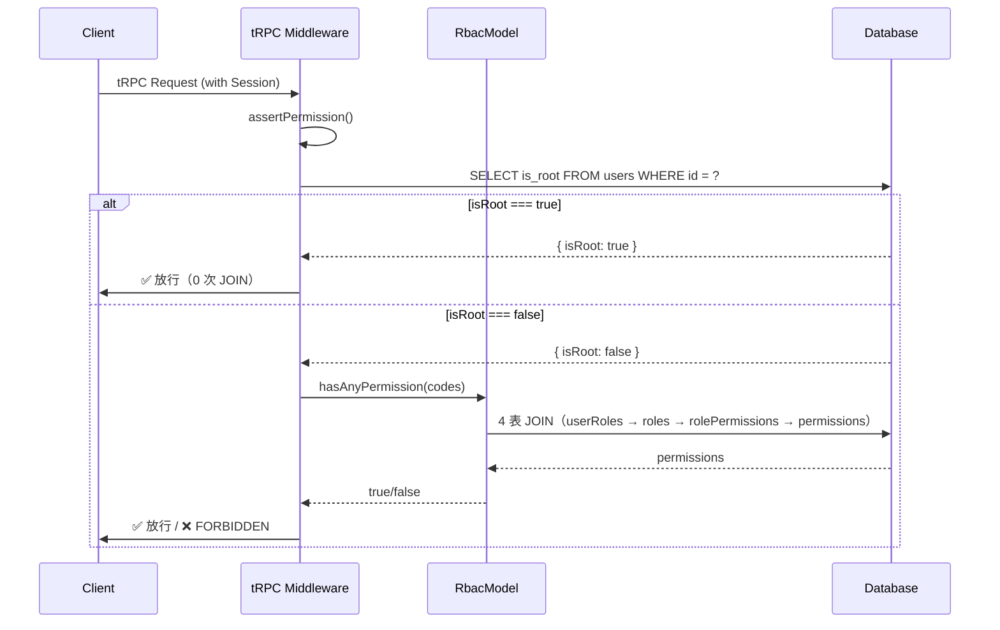

为 LobeHub 添加 `isRoot` 超级管理员字段级权限绕过机制，类似 LifeOS 的设计。

目前在 LobeHub 中，`super_admin` 角色虽然拥有全部 67 个 `:all` 权限，但每次请求仍需走 `rbac_user_roles → rbac_roles → rbac_role_permissions → rbac_permissions` 4 表 JOIN 查询才能放行。这在以下场景造成不必要的性能开销：

1. 超级管理员打开 Admin 页面时，几十个 API 请求各自走 4 表 JOIN
2. 每个 tRPC procedure 都经过 `assertPermission` 触发 JOIN
3. `hasAllPermissions` 对每个权限码单独 JOIN 一次（N 次 JOIN）
4. 角色表被误操作时超管权限可能丢失

改造目标：

- 在 User 表新增 `is_root` 字段（boolean，默认 false）
- 在权限检查中间件最上游加 `isRoot` 短路：查到 `is_root = true` 直接放行，不走 RBAC 查询
- 播种脚本（`init-system-roles.ts`）授予 super_admin 时同步设置 `isRoot = true`
- 后端 Hono 路由等其他权限调用路径同样受益（通过在 RbacModel 层加短路）

本次改动不做功能增强，只做性能优化和容灾兜底——`super_admin` 角色的实际权限不变，只是将 4 表 JOIN 换成 1 次单字段查询。

## Tech Stack

- **数据库层**: Drizzle ORM + PostgreSQL（已有，沿用现有技术栈）
- **后端框架**: Next.js 16 + tRPC + Hono（已有，沿用现有技术栈）
- **认证**: better-auth（已有，沿用现有技术栈）

## Implementation Approach

### 策略说明

四层短路策略，由外到内依次拦截，确保所有权限检查路径都能受益：

1. **tRPC 中间件层**（`assertPermission`）：最上游的拦截点，拦截 all/any/AND/OR/scoped 四种中间件
2. **RbacModel 层**：拦截通过 Hono 路由等非 tRPC 路径调用的权限查询
3. **数据库迁移**：新增字段，播种脚本同步设置
4. **前端扩展**（可选）：通过用户 API 返回 `isRoot` 状态

### 关键决策

- **在 RbacModel 层而非仅在中间件层加短路**：因为 `RbacModel` 被 tRPC 中间件和 Hono 路由两处调用，放在 `RbacModel` 层可以一次性覆盖所有调用方
- **与 LifeOS 保持行为一致**：`isRoot` 跳过权限检查但不跳过资源层的工作区隔离（`workspaceId` 过滤条件由业务层自行保证）
- **播种脚本确保一致性**：同时设置 `rbac_user_roles` 中的角色和 `users.is_root` 字段

## Implementation Notes

### 需修改/新增的文件

| 文件 | 操作 | 说明 |
| --- | --- | --- |
| `packages/database/src/schemas/user.ts` | [MODIFY] | 新增 `isRoot` 字段定义 |
| `packages/business-server/src/trpc-middlewares/rbacPermission.ts` | [MODIFY] | `assertPermission` 开头加 `isRoot` 短路 |
| `packages/database/src/models/rbac.ts` | [MODIFY] | 每个公开方法开头加 `isRoot` 短路 |
| `scripts/init-system-roles.ts` | [MODIFY] | 授予 super_admin 后同步设置 `isRoot = true` |
| 数据库迁移文件 | [NEW] | Drizzle 生成的迁移 |


### 性能考量

- 改前：超级管理员每次请求走 4 表 JOIN（~3-8ms），`hasAllPermissions` 每个 code 独立 JOIN
- 改后：超级管理员每次请求走 1 次单字段查询（~0.5-1ms），节省 75%+ 的数据库查询
- 每日 10000 请求场景下，DB 耗时从 ~50 秒降到 ~5 秒

### 容灾与回滚

- 如果 `isRoot` 导致的问题，执行 `UPDATE users SET is_root = false` 即可全局关闭
- 现有 `super_admin` 角色不受影响，即使 `isRoot` 关闭，超管仍可通过 RBAC 正常访问

## Architecture Design

### 权限检查链路（改后）

```
HTTP / tRPC Request
  │
  ▼
better-auth session 验证
  │
  ▼
tRPC middleware: assertPermission()
  │  ┌─ SELECT is_root FROM users WHERE id = ?  ＜── 新增
  │  │     └─ true → ✅ 直接 return（不走后续 4 表 JOIN）
  │  │
  │  └─ false → 继续走 RBAC...
  │       │
  │       ▼
  │    RbacModel.{hasAny/hasAll/hasPermission}()
  │       └─ isRoot 短路: SELECT is_root FROM users → true return
  │       └─ false → 4 表 JOIN（原有逻辑）
  │
  ▼
Controller Handler
```

### RbacModel 短路流程

```
RbacModel.{hasAnyPermission/hasAllPermission/hasPermission/getUserPermissions/...}()
  │
  ├─ ★ 新增: SELECT is_root FROM users WHERE id = ?
  │     └─ true → 直接 return true/["*"]（覆盖 Hono 路由等调用路径）
  │
  └─ false → 走原有 4 表 JOIN 逻辑
```

### Mermaid 时序图



## Directory Structure

本次修改涉及的项目文件：

```
lobehub-plus-main/
├── packages/
│   ├── database/
│   │   └── src/
│   │       ├── schemas/
│   │       │   └── user.ts                   # [MODIFY] 新增 isRoot 字段
│   │       └── models/
│   │           └── rbac.ts                   # [MODIFY] RbacModel 各方法加 isRoot 短路
│   └── business-server/
│       └── src/
│           └── trpc-middlewares/
│               └── rbacPermission.ts         # [MODIFY] assertPermission 加 isRoot 短路
├── scripts/
│   └── init-system-roles.ts                  # [MODIFY] 授予 super_admin 后同步设置 isRoot
└── 数据库迁移文件                              # [NEW] drizzle generate 生成的迁移
```

### 不修改的文件（完整性说明）

| 文件 | 原因 |
| --- | --- |
| `src/hooks/useUserRoles.ts` | 前端 `isSuperAdmin` 通过角色名计算，`isRoot` 是后端机制，两者独立 |
| `src/features/Admin/Layout/AdminGuard.tsx` | 控制 UI 显示，现有 `isSuperAdmin` 已足够 |
| `packages/const/src/rbac.ts` | 角色/权限常量定义不变 |
| `packages/database/src/utils/seedSystemRoles.ts` | 角色播种逻辑不变 |


## Key Code Structures

### 1. Schema 字段新增（`packages/database/src/schemas/user.ts`）

在 `users` 表的 `role: text('role'),` 之后新增：

```typescript
// isRoot admin flag - bypasses all RBAC permission checks
isRoot: boolean('is_root').default(false).notNull(),
```

### 2. tRPC 中间件短路（`packages/business-server/src/trpc-middlewares/rbacPermission.ts`）

在 `assertPermission` 函数的 `if (!ctx.serverDB)` 检查后、`new RbacModel(ctx.serverDB, userId)` 之前插入：

```typescript
// 在 `if (!ctx.serverDB)` 块后、`const rbacModel = ...` 前插入：

import { users } from '@lobechat/database/schemas/user';
import { eq } from 'drizzle-orm';

// ...

  if (!ctx.serverDB) { ... }

  // ★ isRoot 短路：超级管理员直接放行，不走 4 表 JOIN
  //    与 LifeOS PermissionsGuard 第 60 行的 isRoot 检查逻辑一致
  const [userRow] = await ctx.serverDB
    .select({ isRoot: users.isRoot })
    .from(users)
    .where(eq(users.id, userId))
    .limit(1);

  if (userRow?.isRoot) return;

  const rbacModel = new RbacModel(ctx.serverDB, userId);
  // ... 原有逻辑
```

### 3. RbacModel 短路（`packages/database/src/models/rbac.ts`）

在类的构造函数后、各方法前添加私有方法，并让所有公开方法调用：

```typescript
import { users } from '../schemas/user'; // 新增 import

export class RbacModel {
  private userId: string;
  private db: LobeChatDatabase;

  constructor(db: LobeChatDatabase, userId: string) {
    this.userId = userId;
    this.db = db;
  }

  /** ★ 新增：检查用户是否为 root 管理员 */
  private async isRootUser(): Promise<boolean> {
    const [user] = await this.db
      .select({ isRoot: users.isRoot })
      .from(users)
      .where(eq(users.id, this.userId))
      .limit(1);
    return user?.isRoot ?? false;
  }

  // 在各方法开头调用 isRootUser()
  // hasAnyPermission: if (await this.isRootUser()) return true;
  // hasAllPermissions: if (await this.isRootUser()) return true;
  // hasPermission: if (await this.isRootUser()) return true;
  // getUserPermissions: if (await this.isRootUser()) return ['*']; // 或直接返回所有
  // getUserPermissionDetails: if (await this.isRootUser()) return [];
  // getUserRoles: 不修改（角色查询不受影响）
}
```

### 4. 播种脚本修改（`scripts/init-system-roles.ts`）

在 `assignSystemRoleToUser` 调用后增加：

```typescript
  await assignSystemRoleToUser(serverDB, {
    roleName: SYSTEM_DEFAULT_ROLES.SUPER_ADMIN,
    userId: user.id,
  });
  console.log(`✅ Granted super_admin to ${ADMIN_EMAIL}`);

  // ★ 同步设置 isRoot 字段（与 LifeOS 的 isRoot 机制保持一致）
  await serverDB
    .update(users)
    .set({ isRoot: true })
    .where(eq(users.id, user.id));
  console.log(`✅ Set isRoot=true for ${ADMIN_EMAIL}`);
```

## Agent Extensions

无 — 本次为纯代码实现任务，不依赖外部扩展或 MCP 工具。