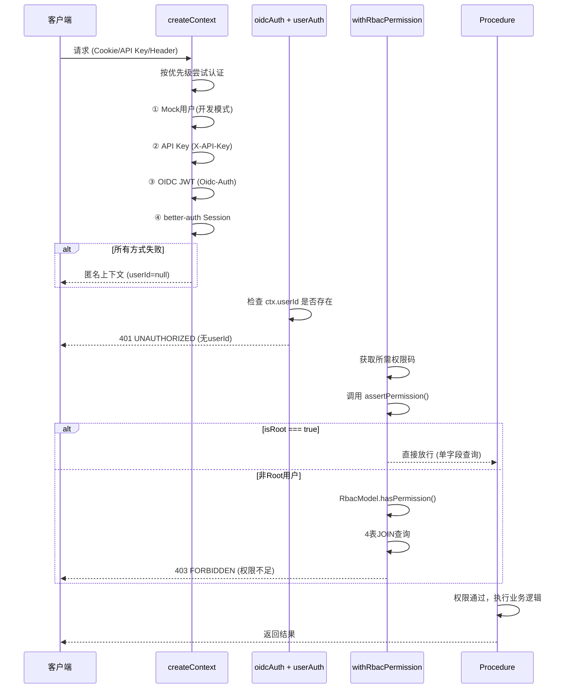

# BuildingAI (LifeOS) vs LobeHub 认证、权限与商业化体系对比

> 调研时间：2026-07-05
> 调研范围：BuildingAI (LifeOS) 源代码（`~/Downloads/BuildingAI/`）+ 运行实例 @localhost:4091 vs LobeHub-plus 源代码（`~/Downloads/lobehub-plus-main/`）+ 运行实例 @localhost:4010

---

## 一、总体对比

| 维度 | BuildingAI (LifeOS) | LobeHub-plus |
|------|-------------------|--------------|
| **后端框架** | NestJS 11 | Next.js 16 (tRPC) |
| **前端框架** | Vue 3 (Nuxt UI) | React 19 (@lobehub/ui / antd) |
| **ORM** | TypeORM 0.3.x | Drizzle ORM |
| **认证框架** | 自研 JWT (passport-jwt + bcryptjs) | better-auth |
| **权限模型** | RBAC（2 表 + 用户直连权限） | RBAC（4 表，系统级+工作区级） |
| **超级管理员** | `isRoot=YES` 字段短路 | `isRoot=true` 字段 + `super_admin` 角色双重机制 |
| **支付** | 微信支付 + 支付宝完整 SDK 集成 | 微信/支付宝/Stripe 配置管理（Stripe 仅 Schema 预留） |
| **会员体系** | 等级 + 套餐 + 订单 + 退款完整系统 | 套餐 + 订阅 + 积分交易系统 |
| **运营后台** | 系统配置 + 字典配置 + 健康检查 + 审计日志 | 消费追踪 + 内容审核 + 通知系统 + 审计日志 + 健康监控 |
| **扩展机制** | 插件扩展系统 (extensions/) | 无原生插件系统 |
| **许可证** | 商业许可证 | Apache 2.0 |

---

## 二、认证体系对比

### 2.1 技术栈

| 维度 | BuildingAI (LifeOS) | LobeHub-plus |
|------|-------------------|--------------|
| **认证方式** | JWT Bearer Token | better-auth Session (cookie-based) |
| **密码加密** | bcryptjs | better-auth 内置（bcrypt） |
| **令牌过期** | 默认 30 天（可配置），支持滑动刷新 | 由 better-auth 管理 |
| **令牌缓存** | 内存 + Redis 双级缓存 | better-auth 内置 |
| **多端登录控制** | 支持（通过字典配置 `allowMultipleLogin`） | 未发现 |
| **令牌撤销** | 支持（`isRevoked` 字段） | better-auth 内置 |

### 2.2 注册与登录方式

| 维度 | BuildingAI (LifeOS) | LobeHub-plus |
|------|-------------------|--------------|
| **邮箱+密码** | ✅ | ✅ |
| **手机号+验证码** | ✅ | ❌（仅 OTP） |
| **微信登录** | ✅（openid 自动注册/登录） | ✅ |
| **OAuth/SSO** | GitHub, Google 等 | Google, GitHub, Apple, Microsoft, Auth0, Okta, Keycloak, Zitadel, 飞书 等 20+ |
| **Magic Link** | ❌ | ✅ |
| **Passkey** | ❌ | ✅（WebAuthn） |
| **注册来源追踪** | ✅ `source` 字段（ACCOUNT/PHONE/WECHAT/CONSOLE） | ❌ 未发现 |

### 2.3 认证守卫链

**BuildingAI (LifeOS)**：
```
请求 → AuthGuard (JWT验证) → PermissionsGuard (权限码检查) → SuperAdminGuard (isRoot) → MemberOnlyGuard (会员等级) → Controller
```

**LobeHub-plus**：
```
请求 → createLambdaContext (认证) → oidcAuth (OIDC) → userAuth (userId检查) → withRbacPermission (权限检查) → Procedure
```

### 2.4 优缺点

| 项目 | BuildingAI (LifeOS) | LobeHub-plus |
|------|-------------------|--------------|
| **优点** | JWT 无状态，适合分布式；支付网关认证机制成熟 | better-auth 开箱即用，支持认证方式最丰富；Session 安全（可撤销） |
| **缺点** | JWT 无法主动撤销（需 Redis 黑名单）；需要自行管理安全 | Session 有状态，需要数据库查询；better-auth 定制灵活性受限 |

---

## 三、用户模型对比

### 3.1 权限相关字段

| 字段 | BuildingAI (LifeOS) | LobeHub-plus |
|------|-------------------|--------------|
| **`isRoot`** | `BooleanNumber` (0/1)，默认 `NO` | `boolean`，默认 `false` |
| **`role`** | `ManyToOne → Role`（一个用户一个角色） | 通过 `rbac_user_roles` 关联表（多对多） |
| **`permissions`** | `ManyToMany → Permission`（直接权限，`user_permissions` 表） | 通过角色授予，无直接用户权限 |
| **`status`/`banned`** | `status` (0=禁用/1=启用) | `banned`, `banReason`, `banExpires` |
| **`emailVerified`** | ❌ | ✅ |
| **`twoFactorEnabled`** | ❌ | ✅ |

### 3.2 用户-角色关系设计

| 维度 | BuildingAI (LifeOS) | LobeHub-plus |
|------|-------------------|--------------|
| **角色模型** | 一个用户绑定一个角色（`ManyToOne`） | 一个用户可有多个角色（`ManyToMany`，通过关联表） |
| **直接权限** | ✅ 支持（`user_permissions` 关联表，用户可额外绑定权限） | ❌ 不支持 |
| **工作区角色** | 知识库级别 owner/manager/editor/viewer | 完整的工作区级角色（owner/member/viewer） |
| **临时角色** | ❌ | ✅ 支持过期时间（`expires_at`） |

### 3.3 优缺点

| 项目 | BuildingAI (LifeOS) | LobeHub-plus |
|------|-------------------|--------------|
| **优点** | 结构简单（2 个关联表），查询快；用户可直接绑定额外权限，灵活性高 | 支持多角色，权限矩阵更灵活；支持临时角色（过期自动失效） |
| **缺点** | 一个用户只能有一个角色，精细度受限；无工作区级角色体系 | 4 表 JOIN 查询开销大（已通过 `isRoot` 短路优化）；架构复杂 |

---

## 四、新用户默认角色与权限

### 4.1 注册流程对比

**BuildingAI (LifeOS)**：
```
用户注册 → AuthService.register() → 创建用户 → 返回空权限 + 无角色
```
- 新用户 **没有任何角色、没有任何权限**
- 所有功能默认不可用，必须由管理员在后台分配角色/权限才能使用

**LobeHub-plus**：
```
用户注册 (better-auth) → databaseHooks → UserService.initUser()
    → assignSystemRoleToUser(FREE_USER)
    → 用户获得 free_user 角色
```
- 新用户 **自动获得 `free_user` 角色**
- `free_user` 仅能管理自己安装的 Agent（`agent:read|update|delete:owner`）

### 4.2 默认能力对比

| 能力 | BuildingAI (LifeOS) 新用户 | LobeHub-plus 新用户 (free_user) |
|------|--------------------------|-------------------------------|
| **登录** | ✅ | ✅ |
| **修改个人信息** | ❌（需分配权限） | ✅（未限制） |
| **创建会话** | ❌ | ❌（`session:create` 无权限） |
| **发送消息** | ❌ | ❌（`message:create` 无权限） |
| **管理 Agent** | ❌ | ⚠️ 仅管理自己安装的（owner 范围） |
| **使用 AI 模型** | ❌ | ❌ |
| **查看任何页面** | ❌ | ⚠️ 取决于前端路由控制 |

### 4.3 优缺点

| 项目 | BuildingAI (LifeOS) | LobeHub-plus |
|------|-------------------|--------------|
| **优点** | 完全的白名单机制，无任何安全风险；管理员完全掌控 | 开箱即用的最小可用权限，新用户至少能探索界面；后端有完整校验 |
| **缺点** | 新用户注册后完全无法使用，必须有管理员操作才能前进；不适合纯自助注册场景 | `free_user` 权限过少（连会话都不能创建），实际使用体验几乎不可用；需要手动升级用户才能使用 |

---

## 五、RBAC 权限模型对比

### 5.1 数据库表结构

**BuildingAI (LifeOS) — 2 核心表 + 2 关联表**：
```
roles                    permissions
┌──────────────────┐    ┌──────────────────┐
│ id (PK)          │    │ id (PK)          │
│ name (unique)    │    │ code (unique)    │
│ description      │    │ name             │
│ isDisabled       │    │ group/groupName  │
└────────┬─────────┘    │ apiPath/method   │
         │              │ type (SYSTEM/PLUGIN)│
         │              └────────┬─────────┘
         │                       │
         ▼                       ▼
role_permissions            user_permissions
(role_id, permission_id)    (user_id, permission_id)
```
- 一个用户**只能有一个角色**
- 用户可额外绑定直接权限（绕过角色）

**LobeHub-plus — 4 核心表**：
```
rbac_roles                    rbac_permissions
┌──────────────────────┐    ┌──────────────────────┐
│ id (PK)              │    │ id (PK)              │
│ name (unique)        │    │ code (unique)        │
│ display_name         │    │ name                 │
│ description          │    │ description          │
│ is_system            │    │ category             │
│ is_active            │    │ is_active            │
│ workspace_id (??)    │    └──────────┬───────────┘
└──────────┬───────────┘               │
           │                           │
           ▼                           ▼
    rbac_role_permissions       rbac_user_roles
    (role_id, permission_id)    (id, user_id, role_id, workspace_id, expires_at)
```
- 支持**多个角色**同时赋予一个用户
- 角色分**系统级**（`workspace_id=NULL`）和**工作区级**（`workspace_id=UUID`）
- 支持**临时角色**（`expires_at`）

### 5.2 权限编码格式

| 维度 | BuildingAI (LifeOS) | LobeHub-plus |
|------|-------------------|--------------|
| **格式** | `group:action` | `resource:action:scope` |
| **示例** | `users:list`, `role:create`, `system:config` | `agent:create:all`, `session:read:owner` |
| **作用域** | 无内置作用域概念 | 内置 `:all`（所有资源）和 `:owner`（仅自己资源） |
| **自动发现** | ✅ 控制器装饰器扫描，启动时自动同步到数据库 | ❌ 手动在 `rbac.ts` 常量中定义 |
| **分组** | 通过 `@ConsoleController` 的分组名称 | 通过 `category` 字段 |
| **数量** | 自动生成（视控制器数量而定） | 约 60 个（显式定义） |

### 5.3 系统预置角色

| BuildingAI (LifeOS) | LobeHub-plus |
|---------------------|--------------|
| 无系统预置角色（初始空数据库，由安装向导创建 admin） | `super_admin` — 全部 `:all` 权限 |
| | `vip_user` — 可创建/拷贝 Agent，管理自己资源 |
| | `free_user` — 仅管理自己安装的 Agent |

### 5.4 工作区级角色

| 角色 | BuildingAI (LifeOS) | LobeHub-plus |
|------|-------------------|--------------|
| **Owner** | 知识库所有者（可转让/删除） | 完整访问，含计费管理 |
| **Manager** | 管理团队成员/项目 | — |
| **Member** | — | 创建/编辑自己内容，调用 AI 模型 |
| **Editor** | 上传和编辑数据 | — |
| **Viewer** | 仅查看 | 只读，不能创建消息/调用模型 |

### 5.5 优缺点

| 项目 | BuildingAI (LifeOS) | LobeHub-plus |
|------|-------------------|--------------|
| **优点** | 结构简单直观；权限自动发现维护成本低；用户可直接绑定权限，灵活绕过角色 | 四表架构支持多角色矩阵；工作区级角色隔离完善；权限作用域（:all/:owner）精细化；临时角色自动过期 |
| **缺点** | 单角色限制，需要额外用户直接权限来弥补灵活性；无内置作用域概念，`all`/`owner` 需自行实现 | 查询复杂（4 表 JOIN），需要 `isRoot` 短路优化；权限管理页面学习成本高；权限定义和分配需要手动维护 |

---

## 六、超级管理员机制对比

### 6.1 机制对比

| 维度 | BuildingAI (LifeOS) | LobeHub-plus |
|------|-------------------|--------------|
| **方式一** | `isRoot=YES` 字段，直接绕过所有权限检查 | `isRoot=true` 字段，`RbacModel` 中短路返回 `true` |
| **方式二** | ❌ 不支持 | ✅ `super_admin` 角色，拥有全部 `:all` 权限 |
| **创建方式** | 安装向导页面 `/install` 创建 | 通过 `assignSystemRoleToUser()` 或在数据库中直接设置 |
| **绕过范围** | 所有 `PermissionsGuard`、`SuperAdminGuard` 守卫 | 所有 `assertPermission()` 调用（tRPC 中间件） |

### 6.2 代码实现对比

**BuildingAI (LifeOS)** — `PermissionsGuard` 中检查：
```typescript
// 如果用户是超级管理员，跳过权限检查
if (request.user?.isRoot === BooleanNumber.YES) {
  return true;
}
```

**LobeHub-plus** — `RbacModel` 中检查：
```typescript
isRootUser(userId: string) {
  return this.db.query.users.findFirst({
    where: eq(users.id, userId),
    columns: { isRoot: true },
  });
}

async hasPermission(userId: string, code: string) {
  if (await this.isRootUser(userId)) return true;
  // ... 4 表 JOIN 查询
}
```

### 6.3 优缺点

| 项目 | BuildingAI (LifeOS) | LobeHub-plus |
|------|-------------------|--------------|
| **优点** | 简单高效，安装向导即创建，开箱即用 | `isRoot` 短路高效 + `super_admin` 角色可通过 RBAC 管理，双重灵活 |
| **缺点** | `isRoot` 只能后端手动设置，没有通过 RBAC 管理的途径 | 设计稍显冗余（两个机制功能重叠），新开发人员需要理解双重机制 |

---

## 七、权限检查链路对比

### 7.1 BuildingAI (LifeOS) 权限检查链路

```mermaid
sequenceDiagram
    participant Client as 客户端
    participant AuthG as AuthGuard (JWT)
    member of AuthG section PermG as PermissionsGuard
    participant SuperG as SuperAdminGuard
    participant Ctrl as Controller

    Client->>AuthG: 请求 + JWT Token
    AuthG->>AuthG: 验证 JWT 签名/过期
    AuthG->>AuthG: 双级缓存检查 (内存→Redis→DB)
    AuthG-->>Client: 401 未授权 (验证失败)
    AuthG->>PermG: 验证通过，传递 user

    PermG->>PermG: 获取路由 @Permissions 列表
    alt isRoot === YES
        PermG-->>SuperG: 直接放行
    else 需要权限检查
        PermG->>PermG: 查询 user.role.permissions + user.permissions
        PermG->>PermG: 检查是否拥有所需权限码
        PermG-->>Client: 403 禁止 (权限不足)
    end

    alt @SuperAdminOnly()
        SuperG->>SuperG: 检查 isRoot === YES
        SuperG-->>Client: 403 (非超级管理员)
    end

    alt @MemberOnly()
        SuperG->>SuperG: 检查会员等级
    end

    SuperG->>Ctrl: 所有守卫通过，执行业务逻辑
    Ctrl-->>Client: 返回结果
```

### 7.2 LobeHub-plus 权限检查链路



---

## 八、商业化功能对比

### 8.1 支付系统

| 维度 | BuildingAI (LifeOS) | LobeHub-plus |
|------|-------------------|--------------|
| **微信支付** | ✅ 完整 SDK 集成 — 支持 V2/V3 版本、普通商户/子商户、预支付、回调、退款 | ✅ 支付配置管理（enabled, appId, mchId, apiKey, apiCert） |
| **支付宝** | ✅ 完整 SDK 集成 — appId、私钥、证书、回调、同步回跳 | ✅ 支付配置管理（enabled, appId, privateKey, publicKey, gateway） |
| **Stripe** | ❌ | ⚠️ 仅 Schema 预留字段，无具体实现 |
| **退款系统** | ✅ 完整退款服务（支持微信/支付宝，含积分扣回） | ❌ 未发现 |
| **支付配置管理** | ✅ 后台配置页面（启用/禁用、设置默认支付方式） | ✅ 管理页面 `PaymentSettings.tsx` |
| **支付 SDK 独立性** | ✅ 独立 SDK 包（`@buildingai/wechat-sdk`, `@buildingai/alipay-sdk`） | ❌ 仅 API 配置，无独立 SDK 层 |

### 8.2 会员/套餐系统

| 维度 | BuildingAI (LifeOS) | LobeHub-plus |
|------|-------------------|--------------|
| **会员等级** | ✅ 等级管理（级别、赠送积分、赠送存储空间、权益配置） | ❌ 无等级概念，直接使用套餐 |
| **套餐计划** | ✅ 多套餐（名称、标签、时长：月度/季度/半年/年度/终身/自定义） | ✅ 套餐管理（名称、价格、月积分、个人/工作区预算、计费周期、功能列表） |
| **订阅管理** | ✅ 订单系统（提交、列表含统计、详情、退款） | ✅ 订阅 CRUD（active/canceled/expired/past_due）、取消/续订 |
| **积分系统** | ✅ 赠送积分（等级关联） | ✅ 完整积分系统（配置、交易、调整、推荐奖励） |
| **计费周期** | 月/季/半年/年/终身/自定义 | monthly/yearly/lifetime |
| **管理后台** | 等级列表、套餐列表、订单列表、退款管理 | 套餐列表、订阅列表、积分配置 |

### 8.3 AI 消费追踪

| 维度 | BuildingAI (LifeOS) | LobeHub-plus |
|------|-------------------|--------------|
| **消费日志** | ❌ 未发现 | ✅ 完整 `spend_logs` 表（用户/模型/Token/成本/积分/状态） |
| **Token 统计** | ❌ | ✅ promptTokens, completionTokens, totalTokens |
| **成本核算** | ❌ | ✅ inputCost, outputCost, totalCost (CNY)，含汇率快照 |
| **积分消耗** | ❌ | ✅ creditsConsumed, pricePerCredit |
| **消费报表** | ❌ | ✅ 用户维度、模型维度、每日趋势、消费排行 |
| **生成计费** | ❌ | ⚠️ 图片/视频生成计费为桩模块（接口已定义，逻辑未实现） |

### 8.4 收入分析

| 维度 | BuildingAI (LifeOS) | LobeHub-plus |
|------|-------------------|--------------|
| **收入仪表盘** | ❌ 未发现 | ✅ 活跃订阅数、总积分销售、总消费成本、总 Token |
| **收入趋势** | ❌ | ✅ 每日订阅数、每日积分充值 |
| **订阅分析** | ❌ | ✅ 按状态/计费周期分布、即将过期列表 |
| **积分分析** | ❌ | ✅ 按交易类型分组统计 |

### 8.5 优缺点

| 项目 | BuildingAI (LifeOS) | LobeHub-plus |
|------|-------------------|--------------|
| **优点** | 支付集成深度最深（SDK 级），微信/支付宝均完整对接；会员等级体系完善（等级+赠送积分+存储）；退款系统完整（含积分扣回）；订单+快照机制严谨 | 支付配置灵活（三合一后台）；完整的 AI 消费追踪能力（Token/成本/积分）；收入分析仪表盘功能丰富；积分系统独立完善（含推荐奖励） |
| **缺点** | 无 AI 消费追踪；无收入分析仪表盘；无积分交易系统（等级赠送为主） | 支付集成深度浅（仅配置管理，无 SDK 层）；Stripe 未实现；图片/视频计费未实现；推荐/充值/存储超额均为桩模块 |

---

## 九、运营功能对比

### 9.1 通知系统

| 维度 | BuildingAI (LifeOS) | LobeHub-plus |
|------|-------------------|--------------|
| **通知类型** | ❌ 未发现独立通知系统（可能内嵌在业务模块中） | ✅ 完整通知系统：`budget`(预算)、`subscription`(订阅) |
| **通知事件** | ❌ | ✅ `budget_exhausted` 预算耗尽、`subscription_expiring` 订阅即将过期 |
| **投递渠道** | ❌ | ✅ `inbox`(站内信)、`email`(邮件)、`push`(推送) |
| **去重机制** | ❌ | ✅ `dedupeKey` |
| **归档清理** | ❌ | ✅ 基于时间的归档和清理 |

### 9.2 审计日志

| 维度 | BuildingAI (LifeOS) | LobeHub-plus |
|------|-------------------|--------------|
| **审计日志** | ✅ 有审计日志表（`audit_logs`） | ✅ 工作区审计日志表（`workspace_audit_logs`） |
| **记录维度** | 操作、资源、用户、IP | action, resourceType, resourceId, metadata, ipAddress |
| **管理页面** | ✅ 后台审计日志列表 | ✅ `AuditLogList.tsx` + 详情抽屉 |

### 9.3 健康监控

| 维度 | BuildingAI (LifeOS) | LobeHub-plus |
|------|-------------------|--------------|
| **健康检查** | ✅ 健康检查 API（`/consoleapi/health`） | ✅ `system_health_checks` 表（服务名、状态、响应时间） |
| **服务状态** | ✅ Docker 健康检查 | ✅ healthy/degraded/down |
| **管理页面** | ❌ 未发现后台监控面板 | ✅ `SystemHealthDashboard.tsx`（状态卡片+历史列表） |

### 9.4 系统配置

| 维度 | BuildingAI (LifeOS) | LobeHub-plus |
|------|-------------------|--------------|
| **系统配置** | ✅ 字典配置系统（动态键值对配置） | ✅ 系统配置管理（语言、文件大小、注册开关、系统名称） |
| **安装向导** | ✅ `/install` 页面创建超级管理员+初始化系统 | ❌ 无安装向导（better-auth 自带设置流程） |
| **功能开关** | ✅ 字典配置可做功能开关 | ✅ 注册启用开关等 |
| **扩展配置** | ✅ 插件扩展的配置管理 | ❌ 无插件系统 |

### 9.5 内容审核

| 维度 | BuildingAI (LifeOS) | LobeHub-plus |
|------|-------------------|--------------|
| **内容审核** | ❌ 未发现 | ✅ `content_moderation_logs` 表 |
| **审核类型** | ❌ | message, file, knowledge_base |
| **审核结果** | ❌ | safe, flagged, blocked |
| **人工审核** | ❌ | ✅ 管理后台批准/拒绝操作 |

### 9.6 扩展机制

| 维度 | BuildingAI (LifeOS) | LobeHub-plus |
|------|-------------------|--------------|
| **扩展系统** | ✅ `extensions/` 目录 + `@ExtensionsModule` 装饰器 | ❌ 无原生插件系统 |
| **能力** | 动态加载控制器/服务/实体，复用主系统认证和权限 | — |
| **示例** | bazi-profile（八字分析）、simple-blog（博客） | — |

### 9.7 优缺点

| 项目 | BuildingAI (LifeOS) | LobeHub-plus |
|------|-------------------|--------------|
| **优点** | 字典配置系统灵活（无需改代码即可调参数）；安装向导对部署友好；扩展系统支持第三方功能扩展；有数据传输加密 | 通知系统完善（多通道+去重+归档）；消费追踪和健康监控面板完整；内容审核功能实用；收入分析仪表盘完善 |
| **缺点** | 无 AI 消费追踪；无收入分析仪表盘；无独立通知系统；无内容审核模块；健康监控后台未实现 | 扩展能力为 0；无安装向导（部署复杂度高）；无字典配置（改配置需改代码）；部分运营功能为桩模块 |

---

## 十、综合优缺点分析

### 10.1 BuildingAI (LifeOS)

**核心优势**：
1. **支付集成最深** — SDK 级对接微信/支付宝，退款+积分扣回完整闭环，适合商业运营
2. **会员体系完善** — 等级 + 套餐 + 订单 + 退款 + 赠送积分，开箱即用的会员商城
3. **架构简洁高效** — 2 表 RBAC + JWT 无状态认证，查询快、维护成本低
4. **扩展能力强** — `extensions/` 插件系统，可动态挂载第三方模块
5. **部署体验好** — Docker Compose + 安装向导，一启动即可使用

**核心劣势**：
1. **无 AI 消费追踪** — 无法按 Token/模型/用户统计使用成本
2. **无收入分析仪表盘** — 无法直观看到收入趋势和订阅分析
3. **精细节权不足** — 单角色限制，无资源作用域（:all/:owner）概念
4. **新用户默认不可用** — 注册后完全无权限，不适合自助式体验

### 10.2 LobeHub-plus

**核心优势**：
1. **RBAC 体系最完善** — 4 表 + 系统级/工作区级 + `:all`/`:owner` 作用域 + 临时角色
2. **AI 消费追踪完整** — 按 Token/模型/用户统计成本，每日趋势/消费排行
3. **运营功能全面** — 通知系统、内容审核、健康监控、审计日志一应俱全
4. **超级管理员双重机制** — `isRoot` 短路（性能） + `super_admin` 角色（可管理）
5. **认证方式最丰富** — better-auth 支持 20+ OAuth 提供商 + Magic Link + Passkey

**核心劣势**：
1. **支付集成深度不足** — 仅配置管理，无 SDK 层；Stripe/充值/推荐均为桩模块
2. **无扩展能力** — 无法通过插件扩功能，新增功能需要改核心代码
3. **新用户几乎不可用** — `free_user` 权限连会话都不能创建，必须手动升级
4. **架构复杂度高** — 4 表 JOIN 虽然短路优化了 `isRoot`，但非 root 用户仍要承担查询开销
5. **部署门槛高** — 无安装向导，需要手动配置环境和运行迁移

### 10.3 关键差异总结

```
                    BuildingAI (LifeOS)           LobeHub-plus
                    ──────────────────           ────────────
支付深度            ●●●●● SDK 级集成             ●●○○○ 配置管理
会员体系            ●●●●● 等级+套餐+订单          ●●●○○ 套餐+订阅
AI 消费追踪         ○○○○○ 无                     ●●●●● 完整
运营后台            ●●●○○ 基础功能               ●●●●● 全面
RBAC 精细度         ●●●○○ 2表+单角色             ●●●●● 4表+多角色
扩展能力            ●●●●● 插件系统               ○○○○○ 无
部署易用性          ●●●●● Docker+向导            ●●○○○ 手动配置
新用户体验          ○○○○○ 注册后空权限            ●●○○○ 最小权限
认证多样性          ●●●○○ JWT + 3种              ●●●●● 20+ 种
```

---

## 十一、总结与适用场景建议

### 适用场景

| 场景 | 推荐系统 | 原因 |
|------|---------|------|
| **以商业变现为核心** | BuildingAI (LifeOS) | 支付 SDK 集成深、会员等级体系完整、退款流程闭环 |
| **以 AI 成本管控为核心** | LobeHub-plus | 完整 Token/成本追踪、积分消耗、消费排行 |
| **需要精细化权限控制** | LobeHub-plus | 4 表 RBAC + 工作区角色 + 临时角色 + 资源作用域 |
| **需要快速部署上线** | BuildingAI (LifeOS) | Docker Compose + 安装向导，开箱即用 |
| **需要扩展第三方功能** | BuildingAI (LifeOS) | 插件扩展系统，可动态加载 |
| **需要多 OAuth 登录** | LobeHub-plus | better-auth 支持 20+ 身份提供商 |
| **需求 AI 平台+SAAS 运营** | **两者结合** | LifeOS 的支付/会员 + LobeHub 的消费追踪/RBAC |

### 互学建议

| 方向 | 建议 |
|------|------|
| **LobeHub 学 LifeOS** | ① 增加支付 SDK 层（而非仅配置管理）；② 实现安装向导（降低部署门槛）；③ 考虑插件扩展架构；④ 添加字典配置系统 |
| **LifeOS 学 LobeHub** | ① 增加 AI 消费追踪（Token+成本）；② 完善 RBAC（多角色+作用域）；③ 增加收入分析仪表盘；④ 增加通知系统 |

> **核心判断**：BuildingAI (LifeOS) 是**偏商业化运营**的平台，适合做 SaaS 变现；LobeHub-plus 是**偏 AI 技术管控**的平台，适合做企业级 AI 服务管理。两者各自的优势恰好是对方的短板，具有很强的互补性。

---

## 附录：关键文件索引

### BuildingAI (LifeOS)

| 功能 | 关键文件 |
|------|---------|
| 认证 AuthGuard | `packages/api/src/common/guards/auth.guard.ts` |
| 权限守卫 | `packages/api/src/common/guards/permissions.guard.ts` |
| 超级管理员守卫 | `packages/api/src/common/guards/super-admin.guard.ts` |
| User 实体 | `packages/@buildingai/db/src/entities/user.entity.ts` |
| Role / Permission 实体 | `packages/@buildingai/db/src/entities/` |
| 支付模块 | `packages/api/src/modules/pay/` |
| 会员模块 | `packages/api/src/modules/membership/` |
| 支付配置 | `packages/api/src/modules/system/services/payconfig.service.ts` |
| 字典配置 | `packages/api/src/modules/dict/` (或类似路径) |
| 扩展系统 | `extensions/` |

### LobeHub-plus

| 功能 | 关键文件 |
|------|---------|
| better-auth 配置 | `src/auth.ts`, `src/libs/better-auth/define-config.ts` |
| tRPC 上下文 | `packages/trpc/src/lambda/context.ts` |
| RBAC 中间件 | `packages/business-server/src/trpc-middlewares/rbacPermission.ts` |
| RbacModel | `packages/database/src/models/rbac.ts` |
| 数据库 Schema (RBAC) | `packages/database/src/schemas/rbac.ts` |
| 数据库 Schema (用户) | `packages/database/src/schemas/user.ts` |
| 权限常量 | `packages/const/src/rbac.ts` |
| 种子数据 | `packages/database/src/utils/seedSystemRoles.ts` |
| 支付 Schema | `packages/database/src/schemas/paymentPlans.ts` |
| 订阅 Schema | `packages/database/src/schemas/subscriptions.ts` |
| 积分 Schema | `packages/database/src/schemas/creditTransactions.ts` |
| 消费日志 Schema | `packages/database/src/schemas/spendLogs.ts` |
| 通知 Schema | `packages/database/src/schemas/notification.ts` |
| 支付路由 | `packages/business-server/src/lambda-routers/payment.ts` |
| 订阅路由 | `packages/business-server/src/lambda-routers/subscription.ts` |
| 消费路由 | `packages/business-server/src/lambda-routers/spend.ts` |
| 收入路由 | `packages/business-server/src/lambda-routers/revenue.ts` |
